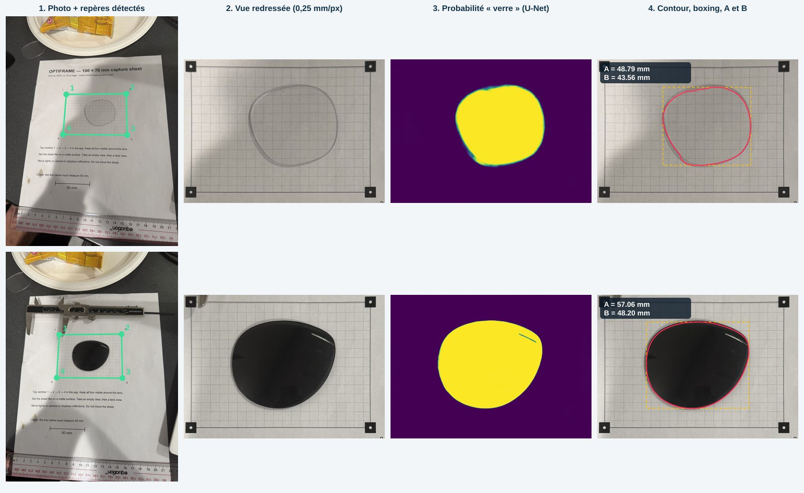
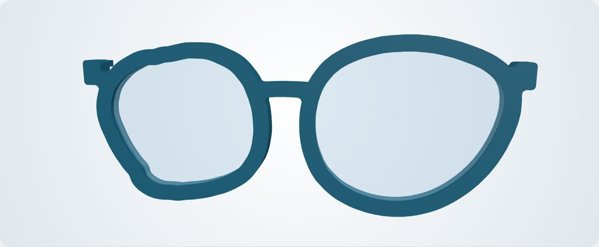
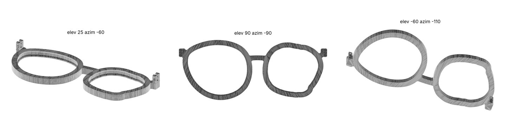

# OptiFrame — des verres recyclés à la monture imprimée en 3D

Défi **SN-SF · OptiFrame** (CodeML 2026). Web app mobile qui, à partir d'une photo d'un verre de lunettes posé sur une feuille de capture imprimée, **mesure son contour au millimètre** et **génère une monture sur mesure imprimable en 3D**, même quand le verre droit et le verre gauche n'ont pas la même forme.

- **App en ligne (HTTPS, sans installation ni compte)** : `https://<utilisateur>.github.io/optiframe/` — QR code : bouton ▦ en haut à droite de l'app.
- **Tout tourne dans le navigateur** : la photo ne quitte jamais le téléphone, aucun serveur, aucune clé API. Après le premier chargement, l'app fonctionne **hors ligne** (service worker), ce qui compte en contexte humanitaire.
- Interface **bilingue FR / EN** (bouton en haut à droite, ou `?lang=en`).

| Palier | Ce que fait OptiFrame |
|---|---|
| 1 · Mesurer | Caméra intégrée avec guidage en direct (ou import), détection automatique des 4 repères, redressement vue de dessus, contour, **A, B, périmètre**, image de contrôle, export **SVG 1:1** |
| 2 · Entraîner l'IA | **U-Net entraîné** sur un jeu **synthétique physiquement réaliste** généré par l'équipe (réfraction de la grille, biseau, ombres portées, reflets, verres clairs et teintés), exécuté dans le navigateur |
| 3 · Concevoir | Monture paramétrique à partir de **deux contours différents** et de la largeur du pont (18 mm par défaut) : cercles avec **rainure de clipsage**, pont, **tenons** ; aperçu 3D et **monture.stl** (maillage fermé, sans supports) |
| 4 · Valider | Superposition verre / rainure avec **écart mesuré sur le maillage**, **écart entre prises** (ΔA, ΔB) et moyenne des prises, contrôle du flou et de la pose de la caméra |



---

## 1. Démarrage

**En ligne** : ouvrir l'URL (ou scanner le QR code) → onglet *Verres* → *Essayer la démo* : deux vraies photos (verre clair en OD, verre teinté en OG) parcourent toute la chaîne jusqu'au STL.

**En local** (l'app n'a aucune dépendance, aucune étape de build) :

```bash
git clone https://github.com/<utilisateur>/optiframe.git && cd optiframe
python3 -m http.server 8080          # puis http://localhost:8080
```

La caméra exige HTTPS (ou `localhost`). Mise en ligne pas à pas : [`DEPLOIEMENT.md`](DEPLOIEMENT.md).

**Tests** (Node 18+, `cd tests && npm install` pour `sharp` ; Playwright pour les tests navigateur) :

```bash
node test_markers.mjs                       # repères sur les vraies photos
node test_nn.mjs                            # moteur JS du U-Net == PyTorch (écart 2e-6)
node test_pipeline.mjs ../models/lensunet   # chaîne complète sur les vraies photos
node eval_real.mjs ../models/lensunet       # comparaison aux références photographiques
node robustness.mjs ../models/lensunet      # 9 dégradations par photo
node test_frame.mjs                         # monture : maillage fermé, écart rainure/verre
python3 e2e.py ; python3 e2e_camera.py      # parcours complet dans Chromium (Pixel 7, iPhone 13, caméra simulée)
```

## 2. Dispositif de capture (remontable en 2 minutes)

- **Feuille de capture** : [`assets/feuille-capture-optiframe.pdf`](assets/feuille-capture-optiframe.pdf) (Letter) ou [`…-A4.pdf`](assets/feuille-capture-optiframe-A4.pdf), générée par [`assets/make_sheet.py`](assets/make_sheet.py) (cotes vectorielles exactes, option `--url` pour imprimer le QR code de l'app). 4 repères carrés de 6 mm avec point blanc ; centres à **100 × 70 mm** ; grille de 5 mm ; **barre d'orientation** sous la grille. La première feuille imprimée par l'équipe (même géométrie, sans barre) est aussi reconnue.
- Imprimer **à 100 %** et vérifier à la règle : 100 mm entre les repères 1 et 2. Sur nos photos, la règle posée sur la feuille confirme l'échelle à ~1 % près (écart dû à l'épaisseur de la règle et à la feuille légèrement bombée). Si l'impression est différente, *Guide → Réglages de mesure* corrige l'échelle en X et en Y.
- Feuille **à plat** (scotchée ou sur un carton), verre au centre de la grille, **face bombée vers le haut**, tel qu'on le voit de face sur les lunettes : le côté nasal de l'OD est à droite, celui de l'OG à gauche (l'app l'affiche ; options *Miroir* et *Pivoter 180°* par verre).
- Téléphone **à plat**, 20 à 30 cm au-dessus du verre. La caméra de l'app affiche en direct les repères (vert : prêt ; orange : trop incliné ou flèche « déplacez le téléphone » pour se placer au-dessus du verre).

## 3. Chaîne de traitement (`js/vision`, `js/nn`, `js/frame`)

```
photo (≤ 3000 px, EXIF lu pour la focale)
 1. Repères    seuillage adaptatif + ouverture + composantes ; « carré plein avec point blanc » (moments) ;
               quadruplet choisi par cohérence géométrique (repères carrés de ~6 mm une fois redressés) ;
               centre sous-pixel = barycentre du point blanc ; 180° levé par la barre d'orientation,
               sinon par le sens de la feuille dans la photo
 2. Redresser  homographie (DLT normalisée) → vue de dessus 0,25 mm/px, X ∈ [-4, 108], Y ∈ [-4, 76] mm ;
               pose de la caméra (focale EXIF ou auto-calibrée) → hauteur, inclinaison, nadir
 3. Segmenter  U-Net (231 k paramètres) → probabilité « verre » ; composante principale, trous bouchés,
               ouverture 0,75 mm ; repli sans IA : seuillage si le modèle ne charge pas
 4. Mesurer    contour polaire sous-pixel (720 rayons, isoligne 0,5, filtre médian) ;
               verre teinté : front d'intensité raffiné sur l'image pleine résolution (± 1 mm) ;
               verre clair : correction du biais calibré (0,17 mm), lissage à 2° ;
               correction de parallaxe du bord du verre ; A, B (boxing ISO 8624), périmètre, diamètre effectif
 5. Monture    manifold-3d : cercles + rainure, pont, tenons → STL ; contrôle par coupe du maillage
```

**Correction de parallaxe.** Le redressement est exact pour le plan de la feuille, mais le bord supérieur du verre est 2 à 3 mm plus haut. Du côté opposé à la caméra, il se projette vers l'extérieur de `h·d/H` (h : hauteur du bord, d : distance au nadir de la caméra, H : hauteur de la caméra), soit jusqu'à ~1 mm sur une photo prise de biais. L'app estime la pose à partir de l'homographie et recule chaque point de `(h/H)·max(0, n·(p − C))` le long de sa normale (h = 2 mm par défaut, réglable). Le côté proche de la caméra montre le bord posé sur la feuille et n'est pas corrigé. Tenir le téléphone au-dessus du verre rend cette correction faible.

**Messages clairs** (pas d'erreur technique) : repères absents, masqués ou coupés, photo floue ou sombre (largeur de transition du point blanc des repères, gradients), téléphone trop incliné, verre absent, coupé par le bord, trop petit ou trop grand ; avertissements « photo un peu floue », « prise de biais (parallaxe corrigée) », « verre posé de travers », « contour incertain ».

## 4. Données et IA

### Pourquoi de l'IA
Un verre transparent n'a presque pas de contraste avec la feuille : on voit une grille à peine décalée, un biseau tantôt clair tantôt sombre, une **ombre portée** à l'extérieur et, du côté opposé à la caméra, la tranche du verre. Un seuillage confond l'ombre et le verre ou ne trouve rien : sur la validation, notre repli classique échoue sur **100 % des verres clairs**.

### Jeu de données (100 % généré par l'équipe, aucune donnée personnelle)
[`training/synth.py`](training/synth.py) rend directement l'image *redressée* que voit le réseau (0,25 mm/px) avec un **masque exact** (couverture sous-pixel). Chaque image tire au hasard :
- **la feuille** : papier, grille 5 mm (pas, décalage et pointillés variables : la grille intérieure de notre première feuille est décalée de ~0,7–1 mm), bordure, repères, numéros, taches, objets qui dépassent (pied à coulisse, règle) ;
- **le verre** : formes boxing réalistes (super-ellipses, aviateur/goutte, côté plat, perturbations de Fourier ; A de 30 à 63 mm) ; verre **clair**, teinté clair, teinté foncé, coloré ;
- **la physique du bord** : réfraction de la grille (grossissement ±1,5 % comme un vrai verre posé sur la feuille, règle de Prentice ; parfois ±5 %), zone de biseau où la grille « se casse », biseau clair ou sombre, **tranche visible d'un côté** (parallaxe), **ombre portée** (largeur, direction et halo aléatoires), caustique ;
- **l'éclairage et la caméra** : dégradés, **ombre de la main / du téléphone**, balance des blancs, reflets spéculaires qui mordent sur le contour, flou, bougé, bruit, JPEG, résolution source plus faible, légère déformation (feuille non plane).

Jeux utilisés : v1 = 3 200 images (43 % de verres clairs) ; v3 = 2 400 images (55 % de verres clairs) ; validation v3 = 240 images (graines distinctes, jamais vues).

**Itérations sur les données** (ce que l'analyse des vraies photos nous a appris) :
1. masques v1 trop larges de ~0,16 mm (anti-crénelage d'OpenCV) → remplissage binaire sur-échantillonné, biais < 0,03 mm ;
2. réfraction v1 trop forte (±10 %) : sur une vraie photo, la grille ne se décale que de ~0,3 mm au bord du verre → grossissement réaliste, pour que le réseau apprenne les vrais indices (biseau, cassure de la grille, ombre extérieure) ;
3. plus de verres clairs (le cas difficile).

### Modèle et entraînement
- **U-Net** 5 niveaux (canaux 8-16-32-48-64), conv 3×3 + BatchNorm + ReLU, sur-échantillonnage bilinéaire : **231 k paramètres (0,9 Mo)**, pensé pour un téléphone en JavaScript pur.
- PyTorch 2.14 sur CPU, AdamW + OneCycle, lots de 8 recadrages 320×320 (centrés sur le verre une fois sur deux), symétries, couleur, gamma, bruit. Perte : BCE **pondérée ×5 près du bord** + Dice. v1 : 4 époques (lr max 3e-3) ; v3 : affinage 5 époques (lr max 2e-3). Journaux : [`training/logs`](training/logs).
- Export ([`training/export.py`](training/export.py)) : BatchNorm fusionnées → `models/lensunet.bin` + `.json` (app) et `models/lensunet.onnx` (ONNX opset 17, vérifié avec ONNX Runtime : écart 2e-5). Dans le navigateur, l'inférence passe par un **moteur JS de ~170 lignes** ([`js/nn/unet.js`](js/nn/unet.js)), vérifié identique à PyTorch (écart 2e-6, `tests/test_nn.mjs`) : 0,9 Mo au lieu de 14 Mo de WASM ONNX Runtime, idéal hors ligne. ~1,1 s pour 448×320 sur un processeur de PC, dans un Web Worker.
- Reproduire : `pip install -r training/requirements.txt`, puis `python synth.py --out data/synth3 --n 2400 --clear 0.55`, `python train.py --data … --val … --resume …`, `python export.py --ckpt …/best.pt --out ../models/lensunet`.

### Performances — validation synthétique (240 images jamais vues, sortie brute du réseau)

| Verres | n | IoU | Erreur de bord (médiane) | Erreur moyenne A/B | Prises à ≤ 1 mm | Échecs (> 5 mm) |
|---|---|---|---|---|---|---|
| **Tous** | 240 | **0,946** | **0,24 mm** | **0,44 mm** | **85 %** | 11 (4,6 %) |
| Clairs | 126 | 0,920 | 0,41 mm | 0,69 mm | 73 % | 10 |
| Teintés foncés | 48 | 0,982 | 0,11 mm | 0,14 mm | 100 % | 0 |
| Teintés clairs | 28 | 0,964 | 0,15 mm | 0,25 mm | 100 % | 0 |
| Colorés | 38 | 0,970 | 0,11 mm | 0,19 mm | 95 % | 1 |
| *Repli classique (seuillage), tous* | 240 | 0,304 | 22 mm | — | 25 % | 170 (verres clairs : 126/126) |

Source : [`docs/eval_synthetique.json`](docs/eval_synthetique.json) (`training/eval_synth.py`). Le biais résiduel sur les verres clairs (+0,34 mm sur A et B : le réseau englobe un peu d'ombre) est retiré dans l'app (0,17 mm par côté).

### Performances — nos propres verres (photos réelles, iPhone 15 Pro)

Nous n'avions pas de mesure au pied à coulisse de ces deux verres pendant le hackathon. Nous les avons donc comparés à des **références photographiques indépendantes du réseau** : là où les traits de la grille disparaissent sous le verre teinté, et la **continuité des traits de grille** pour le verre clair (un trait reste droit dans une ombre mais se casse en entrant dans le verre ; [`training/grid_reference.py`](training/grid_reference.py), sur la photo originale de 24 Mpx).

| Verre | A app | B app | Silhouette app (A × B) | Référence photo (A × B) | Écart A / B |
|---|---|---|---|---|---|
| Clair (OD) | **48,79 mm** | **43,56 mm** | 49,16 × 44,52 | 48,77 × 44,68 (18 points de grille) | +0,39 / −0,16 mm |
| Teinté (OG) | **57,06 mm** | **48,20 mm** | 57,53 × 48,93 | 57,58 × — (contrôle manuel) | −0,05 / — |

« Silhouette » = contour avant correction de parallaxe (photos prises de biais : inclinaison 15° et 11°, correction maximale 0,95 et 0,76 mm). Source : [`docs/eval_reelle.json`](docs/eval_reelle.json).

**Robustesse** (même photo dégradée 9 fois : 3 résolutions, rotations +7° / −12° dans l'image, sous- et surexposition, JPEG q=55, flou ; [`docs/robustesse.json`](docs/robustesse.json)) : **18/18 mesures réussies**.

| Verre | A : moyenne ± écart-type (étendue) | B : moyenne ± écart-type (étendue) |
|---|---|---|
| Clair (OD) | 48,81 ± 0,03 mm (0,09) | 43,54 ± 0,03 mm (0,12) |
| Teinté (OG) | 57,15 ± 0,17 mm (0,56, due au flou) | 48,18 ± 0,03 mm (0,11) |

Caméra intégrée (flux vidéo simulé de 1080 × 1440, sans EXIF) : verre teinté 57,2 × 48,1 mm, cohérent à 0,15 mm près. Temps de calcul : ~1,6–2 s par photo sur un processeur de PC (dont ~1,1 s pour le réseau) ; la démo complète (2 photos) prend ~5 s dans Chromium.

## 5. Monture générée (`js/frame/frame.js`)



*Vues du STL en position d'impression (face avant sur le plateau, tenons vers le haut) :*



- Verres centrés sur leur centre boxing, côtés nasaux face à face, distance entre verres = **largeur du pont** (curseur, 18 mm par défaut). Les deux contours peuvent être différents (la démo associe un verre rond et un verre goutte).
- **Cercle** : contour du verre décalé du jeu + largeur (4 mm par défaut). **Coupe du cercle**, de l'avant vers l'arrière : butée avant (ouverture = verre − 0,8 mm), chanfrein 45°, **rainure** (verre + 0,2 mm de jeu, hauteur = épaisseur du bord + 0,3 mm), chanfrein 45°, **lèvre de clipsage** arrière (verre − 0,45 mm) : le verre se clipse par l'arrière en forçant légèrement. Tous ces paramètres sont réglables dans l'app.
- **Pont** arqué dans le tiers supérieur, congés de raccord. **Tenons** de branches : deux charnières par côté avec un trou de 1,9 mm (axe : un bout de filament de 1,75 mm).
- Booléens robustes avec **manifold-3d**, puis simplification à 5 µm → maillage **fermé et orienté** : `status NoError`, genre 6 (2 verres + 4 trous de charnière), `trimesh.is_watertight = True`, caractéristique d'Euler −10. Exemple : [`docs/exemples/monture.stl`](docs/exemples/monture.stl) (paire de démo : 13 486 triangles, 9,4 cm³ ≈ 12 g de PLA, largeur 139 mm, épaisseur 5,65 mm).
- STL binaire en mm, en **position d'impression** : face avant sur le plateau, tenons vers le haut, **sans supports** (chanfreins à 45°, petits ponts horizontaux).
- **Contrôle verre / cercle** : la monture est coupée au milieu de la rainure et l'app mesure la distance de chaque point du verre au bord de l'ouverture (paire de démo : **0,20 mm** en moyenne et au maximum, soit exactement le jeu prévu).
- Exports : `monture.stl`, contours **SVG 1:1** (barre de contrôle de 50 mm, côté nasal, cotes), mesures **JSON** (contours en mm, prises, paramètres).

## 6. Limites connues

- **Pas de vérité terrain au pied à coulisse** pour nos verres : nos chiffres réels reposent sur des références photographiques. Le jury pourra le vérifier ; nous estimons l'incertitude à ±0,5 mm, davantage sur un verre clair sous une lumière dure.
- **Verres clairs** : la frontière est subtile ; le réseau peut encore englober une partie de l'ombre portée d'un côté (≈ +0,4 mm sur la silhouette A de notre verre clair). Une lumière diffuse et 2–3 prises (l'app affiche l'écart et la moyenne) aident. Une correction par continuité de la grille existe en option expérimentale (*Guide → Réglages*) : physiquement juste, mais encore instable d'une prise à l'autre.
- **Parallaxe** : la correction suppose une hauteur de bord de 2 mm ; un verre très épais photographié de biais garde une erreur de quelques dixièmes. L'app guide pour tenir le téléphone au-dessus du verre.
- **Feuille non plane** : 1 mm de gondolement change l'échelle locale d'environ 0,4 % (0,2 mm sur 50 mm). Scotcher la feuille sur un carton.
- A et B sont mesurés selon les axes de la grille : un verre posé de travers déclenche un avertissement.
- **Monture** : face plate (pas de galbe), rainure plane (elle ne suit pas la courbure du verre ; la hauteur de rainure laisse ~0,3 mm de marge) ; branches non générées (tenons seulement) ; **impression et clipsage non testés physiquement** pendant le hackathon.
- Lunettes complètes (verres montés) non prises en charge : démonter le verre.
- Caméra intégrée : sur iPhone, Safari fournit une image vidéo (souvent 1920×1080) ; *Importer* une photo de l'appareil photo natif donne la meilleure résolution (et la focale EXIF).

## 7. Outils, bibliothèques, modèles et licences

| Élément | Usage | Licence |
|---|---|---|
| [three.js](https://threejs.org) r186 | aperçu 3D | MIT |
| [manifold-3d](https://github.com/elalish/manifold) 3.5.4 | booléens 3D, maillage fermé, coupes | Apache-2.0 |
| [qrcode-generator](https://github.com/kazuhikoarase/qrcode-generator) 2.0.4 | QR code de partage | MIT |
| PyTorch 2.14 | entraînement | BSD-3-Clause |
| ONNX / ONNX Runtime | export et vérification du modèle | Apache-2.0 / MIT |
| OpenCV (Python), NumPy, ReportLab | données synthétiques, analyse, feuille PDF | Apache-2.0 / BSD / BSD |
| Playwright, sharp, trimesh | tests | Apache-2.0 / Apache-2.0 / MIT |
| Modèle `lensunet` | entraîné par l'équipe sur des données 100 % synthétiques | celle du dépôt |
| Photos de démo | prises par l'équipe (métadonnées GPS supprimées) | celle du dépôt |

Aucun jeu de données public ni modèle pré-entraîné n'a été utilisé. Normes : ISO 8624 (système boxing : A, B, pont).

**Outils d'IA** : le code, le générateur de données et la documentation ont été écrits avec l'aide de **Claude (Anthropic)** ; l'équipe a dirigé la conception, pris les photos et vérifié les résultats.

## 8. Structure du dépôt

```
index.html, css/, sw.js, manifest.webmanifest   app (aucune étape de build)
js/app.js            interface, état, exports            js/worker.js   vision + IA + monture (Web Worker)
js/vision/           repères, homographie, redressement, segmentation, contour, raffinement, parallaxe
js/nn/unet.js        moteur d'inférence du U-Net (JS pur)
js/frame/            monture (manifold-3d), STL, SVG 1:1    js/camera.js   caméra intégrée + guidage
lib/                 three.js, manifold-3d, qrcode (copies locales, hors ligne)
models/              lensunet.bin/.json (app), lensunet.onnx
training/            synth.py, model.py, train.py, export.py, eval_synth.py, grid_reference.py, logs/
assets/              feuilles de capture (PDF + make_sheet.py), photos de démo, icônes
tests/               tests Node et Playwright, fixtures
docs/                images, exemples (STL, SVG, JSON), évaluations (JSON)
```
